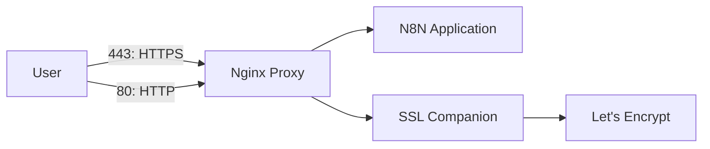

# 🚀 n8n-docker
**The easiest way to deploy n8n with your own domain, automatic SSL, and a reverse proxy**

<div align="center">


### An automated workflow platform with secure HTTPS access and automatic certificate renewal

[](https://docker.com)
[](https://letsencrypt.org)
[](https://nginx.org)

</div>

---

## 📋 Overview

This repository provides a complete Docker Compose setup for deploying **n8n** with:

- 🔒 **Automatic HTTPS** via Let's Encrypt  
- 🌐 **Reverse proxy** using Nginx  
- 🔄 **Automatic SSL renewal**  
- 🏠 **Custom domain** support  
- 🐳 **Containerized architecture**

---

## 🔧 Service architecture (Mermaid diagram)

> GitHub renders Mermaid diagrams in README files. The flowchart below will display correctly on GitHub.



---

## 🛠 Prerequisites

Before deployment make sure you have:

- ✅ Docker & Docker Compose installed  
- ✅ A domain name pointing to your server's IP  
- ✅ Ports **80** and **443** open on your firewall  
- ✅ A valid email address (for Let's Encrypt notifications)

---

## 🚀 Quick Start

### 1. Clone & prepare
```bash
git clone <your-repo-url>
cd n8n-deployment
mkdir -p certs vhost html data
chown 1000:1000 data/
```

### 2. Configure
Edit `docker-compose.yml` and set your email:

```yaml
environment:
  - DEFAULT_EMAIL=your-real-email@domain.com  # replace with your email
```

Set domain environment variables (example):

```yaml
environment:
  - VIRTUAL_HOST=example.com
  - LETSENCRYPT_HOST=example.com
  - DEFAULT_EMAIL=your-real-email@domain.com
  - N8N_EDITOR_BASE_URL=https://example.com/
```

### 3. DNS
Make sure your domain points to the server IP:

```
example.com.  A  xx.xx.xx.xx
```

### 4. Launch
```bash
docker-compose up -d
```

### 5. Verify
```bash
docker-compose ps
```

---

## 📁 Project structure

```text
n8n-deployment/
├── docker-compose.yml
├── docker-compose.override.yml
├── data/
├── certs/
├── vhost/
├── html/
└── README.md
```

---

## 🌐 Access points

| Service        | URL                 | Port | Purpose                          |
|----------------|---------------------|------|----------------------------------|
| n8n Web UI     | https://example.com | 443  | Main application UI              |
| HTTP Redirect  | http://example.com  | 80   | Redirects to HTTPS               |
| Internal n8n   | http://localhost:5678 | 5678 | Direct container access (internal) |

---

## �� SSL & security features

- ✅ Automatic issuance of Let's Encrypt certificates  
- ✅ Automatic renewal before expiry  
- ✅ HTTP → HTTPS redirect  
- ✅ Secure cookie settings recommended  
- ✅ Optional HSTS header configuration

**Security notes**

- Do **not** expose port **5678** publicly.  
- Use a real email for Let's Encrypt notifications.  
- Keep Docker and images updated.  
- Backup the `./data` directory regularly.

---

## 📊 Logs & monitoring

View logs:

```bash
docker-compose logs n8n
docker-compose logs nginx-proxy
docker-compose logs ssl-companion
```

List certificates inside the companion container:

```bash
docker exec ssl-companion ls -la /etc/nginx/certs
```

Force certificate renewal (if available in your setup):

```bash
docker exec ssl-companion /app/force_renew
```

---

## 🛠 Troubleshooting

**SSL not issued / not working**

- Check DNS propagation.  
- Ensure ports 80 and 443 are open.  
- Check logs of the SSL companion container for ACME errors.

**n8n is not reachable**

```bash
docker-compose restart n8n nginx-proxy
```

**Certificate renewal failures**

```bash
docker-compose down && docker-compose up -d
```

---

## 📝 Maintenance

Update containers:

```bash
docker-compose pull
docker-compose up -d
```

Backup data:

```bash
tar -czf n8n-backup-$(date +%Y%m%d).tar.gz ./data
```

Restore from backup:

```bash
tar -xzf n8n-backup-YYYYMMDD.tar.gz
```

---

## 🤝 Contributing

Contributions are welcome:

- Report bugs  
- Suggest features  
- Open pull requests  
- Improve documentation

---

